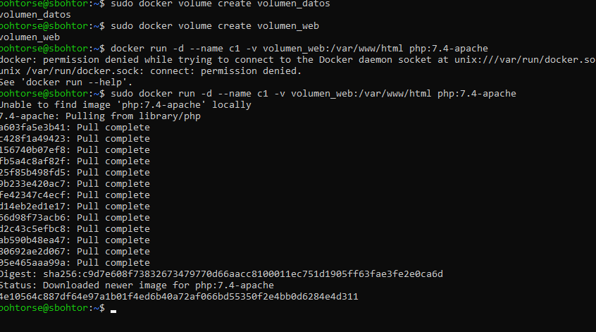
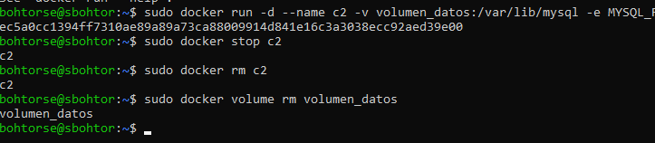
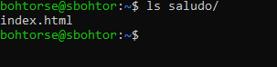

# Docker

## Tarea 4: Descarga de imágenes

## Explicacion

### Crear los volúmenes

- `docker volume create volumen_datos`  
  Crea un volumen llamado `volumen_datos`, utilizado para almacenar datos persistentes en contenedores.

- `docker volume create volumen_web`  
  Crea un volumen llamado `volumen_web`, destinado a almacenar archivos web accesibles por contenedores.

### Arrancar los contenedores

- `docker run -d --name c1 -v volumen_web:/var/www/html php:7.4-apache`  
  Ejecuta el contenedor `c1` en segundo plano con la imagen `php:7.4-apache` y monta `volumen_web` en la ruta `/var/www/html`.

- `docker run -d --name c2 -v volumen_datos:/var/lib/mysql -e MYSQL_ROOT_PASSWORD=admin mariadb`  
  Ejecuta el contenedor `c2` con la imagen `mariadb`, monta `volumen_datos` en `/var/lib/mysql` y establece la contraseña de root como `admin`.

### Parar y borrar el contenedor y volumen

- `docker stop c2`  
  Detiene el contenedor `c2`, lo que lo pone en estado inactivo pero no lo elimina.

- `docker rm c2`  
  Elimina el contenedor `c2` previamente detenido, liberando los recursos asociados.

- `docker volume rm volumen_datos`  
  Elimina el volumen `volumen_datos` de forma permanente, liberando el espacio de almacenamiento utilizado.

## Tarea 8: Arrancar un contenedor

### Paso 1: Crear la carpeta `saludo` y el archivo `index.html`

- `mkdir saludo`  
  Crea una carpeta llamada `saludo` en el directorio actual para almacenar el archivo `index.html`.

- Crear el archivo `index.html` dentro de la carpeta `saludo` con el siguiente contenido:  
  `<h1>HOLA SOY [TU NOMBRE]</h1>`  
  Este archivo contiene el mensaje de saludo, donde deberás reemplazar `[TU NOMBRE]` por tu nombre.

### Paso 2: Arrancar los contenedores con Bind Mount

- `docker run -d --name c1 -v $(pwd)/saludo:/var/www/html -p 8181:80 php:7.4-apache`  
  Ejecuta un contenedor llamado `c1` basado en la imagen `php:7.4-apache` y realiza un **bind mount** de la carpeta `saludo` del sistema host al directorio `/var/www/html` del contenedor. Además, redirige el puerto 80 del contenedor al puerto 8181 del host, permitiendo acceder al contenido de la carpeta desde el navegador.

- `docker run -d --name c2 -v $(pwd)/saludo:/var/www/html -p 8282:80 php:7.4-apache`  
  Ejecuta un segundo contenedor llamado `c2` con la misma configuración, pero redirigiendo el puerto 80 del contenedor al puerto 8282 del host. Esto permite acceder al contenido de `index.html` en un puerto diferente.

