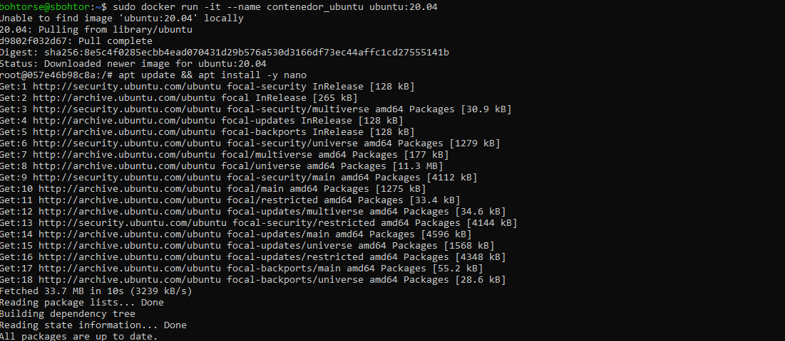
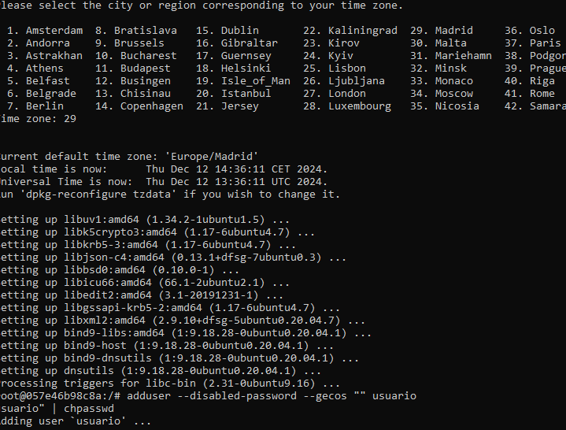

# Docker

## Tarea 4: Descarga de imágenes

## Explicacion

## **1a Parte: Crear una imagen personalizada basada en Ubuntu**

1. **Arrancar un contenedor Ubuntu**:  
   Usamos el comando `docker run -it ubuntu:20.04` para iniciar un contenedor basado en la imagen `ubuntu:20.04`.

2. **Instalar herramientas dentro del contenedor**:  
   Ejecutamos varios comandos `apt install` para instalar `nano`, `vim`, `inetutils-tools`, y `dnsutils`.

3. **Crear un usuario**:  
   Usamos `adduser` y `chpasswd` para crear el usuario `usuario` con la contraseña `usuario`.

4. **Crear una imagen con `docker commit`**:  
   Usamos `docker commit` para crear una nueva imagen con las modificaciones realizadas.

5. **Subir la imagen a Docker Hub**:  
   Iniciamos sesión con `docker login` y subimos la imagen usando `docker push`.

---

## **2a Parte: Crear un Dockerfile basado en `php:7.4-apache`**

1. **Crear el Dockerfile**:  
   Usamos la imagen base `php:7.4-apache` e instalamos `nano` y `git` con `apt install`. Luego, colocamos dos archivos en el directorio `/var/www/html`:  
   - `index.html` con el mensaje `HOLA SOY [TU NOMBRE]`
   - `info.php` que muestra la información de PHP (`phpinfo()`).

2. **Construir la imagen**:  
   Usamos `docker build` para crear la imagen personalizada con el Dockerfile y la etiquetamos como `TuNombreUsuarioDockerHub/a62`.

3. **Subir la imagen a Docker Hub**:  
   Finalmente, subimos la imagen a Docker Hub con `docker push`.

