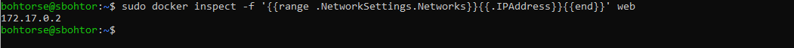

# Docker

## Tarea 4: Descarga de imágenes

## Explicacion

### 1. `docker ps`
Muestra una lista de los contenedores en ejecución en el sistema, indicando el contenedor `bbdd` y otros detalles como el estado y los puertos.

### 2. `docker logs bbdd`
Muestra los registros del contenedor `bbdd`, donde puedes ver mensajes de inicio, errores o cualquier detalle relacionado con el funcionamiento del contenedor.

### 3. `docker exec -it bbdd mysql -u invitado -pinvitado prueba`
Intenta conectarse al contenedor `bbdd` y ejecutar MySQL con el usuario `invitado` y la contraseña `invitado`, usando la base de datos `prueba`.

### 4. `docker exec -it bbdd mysql -u invitado -pinvitado`
Intenta conectarse al contenedor `bbdd` y ejecutar MySQL con el usuario `invitado` y la contraseña `invitado`, sin especificar una base de datos.

### 5. `SHOW DATABASES;`
Comando SQL ejecutado dentro de MySQL para listar todas las bases de datos disponibles en el servidor de MariaDB.

### 6. `USE prueba;`
Comando SQL dentro de MySQL para seleccionar la base de datos `prueba` y comenzar a trabajar con ella.

### 7. `docker exec -it bbdd bash`
Accede al contenedor `bbdd` y abre una terminal interactiva dentro del mismo.

## Tarea 5: Arrancar un contenedor

### 1. `docker inspect -f '{{range .NetworkSettings.Networks}}{{.IPAddress}}{{end}}' <nombre_o_id_del_contenedor_web>`
Obtiene la dirección IP interna del contenedor web dentro de la red de Docker. Esta IP es útil para conectar otros servicios o contenedores entre sí, ya que es la forma en la que Docker asigna direcciones dentro de su red interna.

### 2. `docker port <nombre_o_id_del_contenedor_web>`
Muestra los puertos redirigidos desde el contenedor web hacia la máquina host. Esta información es esencial cuando un contenedor necesita ser accesible desde fuera, como un servidor web o una API expuesta a través de puertos específicos.

### 3. `docker inspect -f '{{range .NetworkSettings.Networks}}{{.IPAddress}}{{end}}' <nombre_o_id_del_contenedor_bbdd>`
Obtiene la dirección IP interna del contenedor de base de datos (bbdd) dentro de la red de Docker. Al igual que el contenedor web, se usa para interacciones entre contenedores dentro de una red Docker.

### 4. `docker port <nombre_o_id_del_contenedor_bbdd>`
Muestra los puertos redirigidos desde el contenedor de base de datos hacia la máquina host. Esto es útil cuando el contenedor de la base de datos necesita estar disponible desde fuera de Docker, por ejemplo, para herramientas de administración o acceso remoto.
