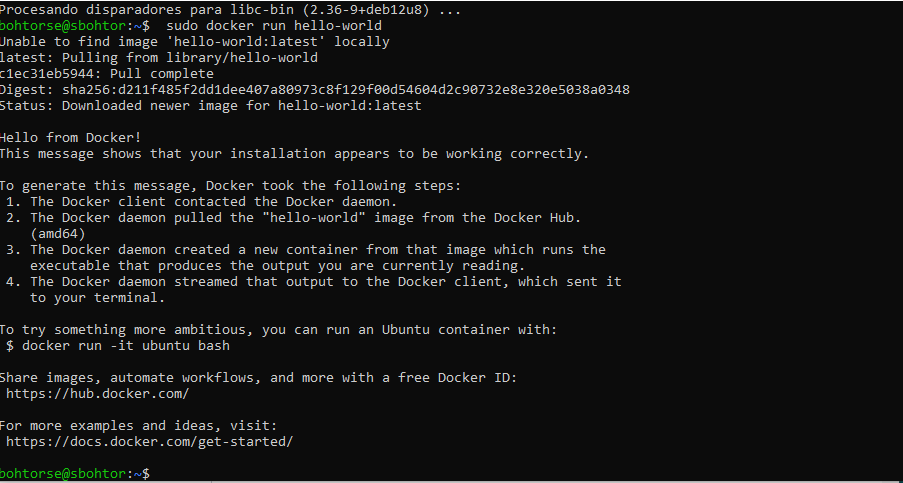
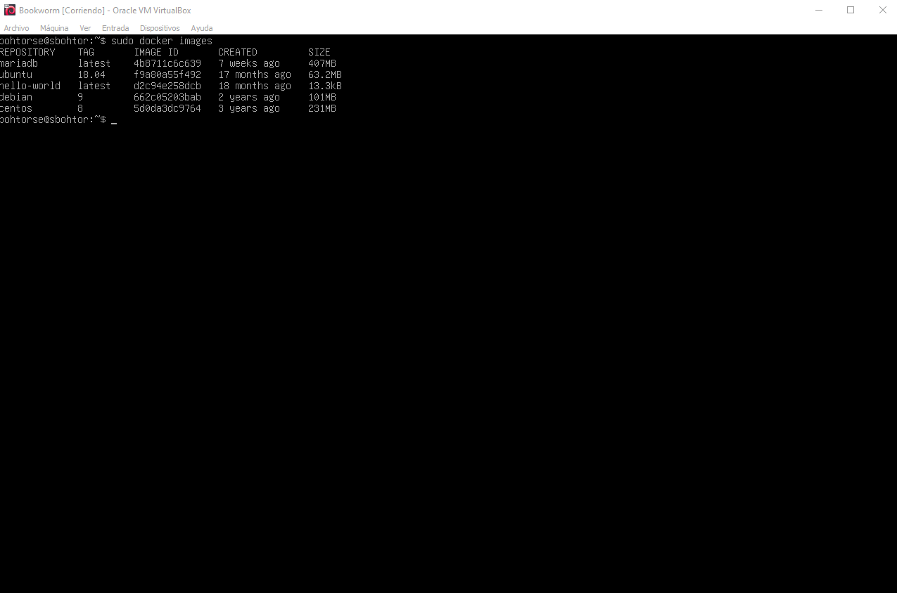
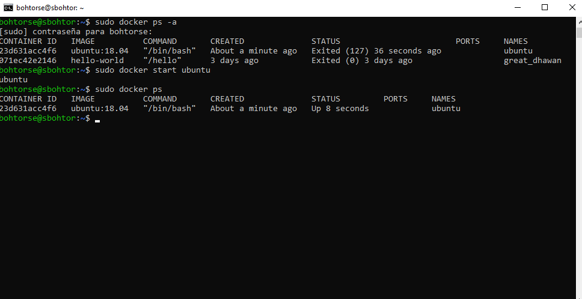

# Docker

## Tarea 1: Instalar docker

sudo apt-get update
sudo apt-get install ca-certificates curl
sudo install -m 0755 -d /etc/apt/keyrings
sudo curl -fsSL https://download.docker.com/linux/debian/gpg -o /etc/apt/keyrings/docker.asc
sudo chmod a+r /etc/apt/keyrings/docker.asc

echo \
  "deb [arch=$(dpkg --print-architecture) signed-by=/etc/apt/keyrings/docker.asc] https://download.docker.com/linux/debian \
  $(. /etc/os-release && echo "$VERSION_CODENAME") stable" | \
  sudo tee /etc/apt/sources.list.d/docker.list > /dev/null
sudo apt-get update

Con esa serie de comandos instalamos docker, una vez instalado podemos usar el docker run hello-world para que se arranque y muestre el mensaje

## Tarea 2: Descarga de imágenes

Con la secuendia de comandos sudo docker pull ("nombre de la imagen"), instalamos la imagen necesarias, en mi caso he instalado 4, aunque en la imagen se ven 5 es porque aparece el hello-world. 

y con el docker images, aparecen las imágenes.

## Tarea 3: Arrancar un contenedor

Con los comandos docker run -it --name ubuntu ubuntu:18.04, arrancamos la imagen, con docker ps mostramos las imagenes arrancadas, y por ultimo nos salimos, y para volverlo a arrancar, con docker start ubuntu la iniciamos.

